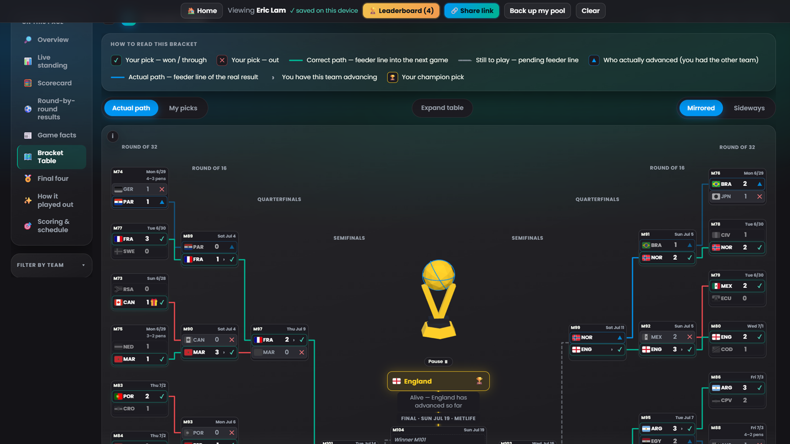
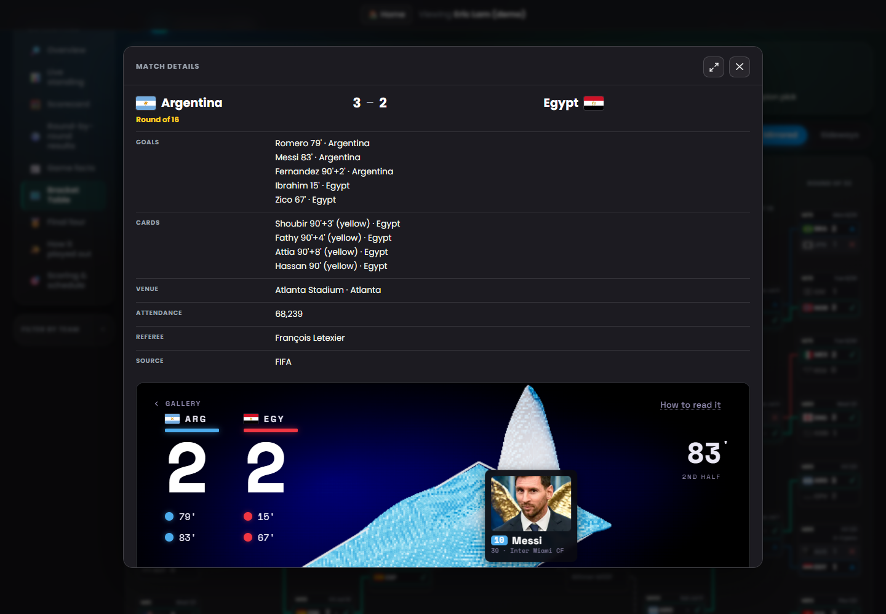
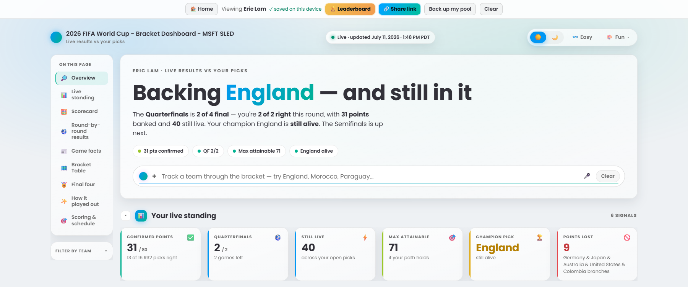

# My World Cup Bracket

Turn your World Cup picks into a live dashboard that scores itself against real results.

## [Open the live dashboard ->](https://eriic-builds.github.io/sled-mywcbracket/)

Built for anyone tracking a World Cup 2026 bracket, whether you are following your own picks or
comparing a pool with friends.

Upload the SLED workbook, build a bracket in the browser, or reopen one already saved on your
device. No install or account is required, and your personal pool stays in your browser.

<p align="center">
  <a href="docs/assets/readme/dashboard-bracket-map.png" aria-label="Open the full-size bracket dashboard image">
    
  </a>
</p>

[](https://github.com/eriic-builds/sled-mywcbracket/actions/workflows/sync-results.yml)
[](https://github.com/eriic-builds/sled-mywcbracket/actions/workflows/deploy-pages.yml)
[](https://github.com/eriic-builds/sled-mywcbracket/actions/workflows/tests.yml)

[Read the project history](dev-docs/PROJECT-HISTORY.md) ·
[Explore the interactive history](https://eriic-builds.github.io/sled-mywcbracket/dev-reports/project-history/) ·
[Open the development reports](https://eriic-builds.github.io/sled-mywcbracket/dev-reports/)

## See what you get

Once your bracket is open, the dashboard gives you:

- **Your score at a glance:** confirmed, settled, attainable, and maximum points update against
  the published tournament results.
- **The tournament and your prediction:** compare the Actual path with My picks and see where
  your bracket remains alive.
- **The story behind each result:** open match cards for scorers, cards, venue, attendance,
  referee, decider notes, and credited portraits.
- **A leaderboard you control:** add bracket links from friends and compare standings and
  undecided picks without creating a shared server pool.

[](docs/assets/readme/argentina-egypt-match-details.png "Open the full-size match details image")

Open a completed match to move beyond the bracket line and into the story of the game. Argentina's
late 3-2 comeback against Egypt is paused here at 88 minutes, still 2-2 before the stoppage-time
winner, alongside the full event timeline and reviewed source details.

<p align="center">
  <a href="docs/assets/readme/dashboard-live-standing.png" aria-label="Open the full-size live-standing dashboard image">
    
  </a>
</p>

Shown here in light mode, the live-standing section turns the current results into six signals you
can read at a glance.

## How to use the dashboard

1. **Open the live site.** Choose **See a demo first** for a finished example, or continue with
   your own bracket.
2. **Add your picks.** Upload the SLED `.xlsx`, choose **Build my bracket**, reopen a bracket
   saved on this device, or import a private pool backup.
3. **Follow the score.** The dashboard matches your picks to public results and shows what is
   confirmed, still attainable, or no longer possible.
4. **Explore the bracket.** Switch between Actual path and My picks, change bracket layouts,
   filter by team, inspect all 31 match cards, and expand the desktop table.
5. **Share and compare.** Create a link containing one bracket. A recipient decides whether to
   add it to their local leaderboard and pick-difference view.
6. **Protect your pool.** Download a private backup of your bracket and locally saved rivals.
   Importing it restores the bracket and merges missing rivals without duplicates.

**[Open the live dashboard ->](https://eriic-builds.github.io/sled-mywcbracket/)**

## Your bracket stays private

| Data | Where it lives |
| --- | --- |
| Your bracket | Your browser |
| Brackets you add | Your browser |
| What-if scores | Your browser, separated by bracket |
| Theme and Motion settings | Your browser |
| One bracket you choose to share | Inside the URL fragment you send |
| Pool backup | A private file downloaded on your action |
| Public tournament results | Static JSON published with the site |
| Match portraits | A credited external source requested after interaction |

The URL fragment containing a shared bracket never reaches GitHub Pages in an HTTP request. It
still contains a copy of that bracket, so it cannot be revoked after someone saves it. Use the
editable share alias when you do not want a real name in the link.

## Make it yours

| Choice | Options |
| --- | --- |
| Layout | Mirrored or Sideways bracket maps, plus an expanded desktop table |
| Theme and type | Dark, light, Easy with OpenDyslexic, and Fun themes including Sticker Book |
| Focus | Team filters, favorites, match facts, and credited portraits |
| Motion and accessibility | Interactive soccer balls, Motion Off, reduced-motion support, and static WebGL fallbacks |

## How this became the final version

The idea started with an Excel attachment and a Microsoft Cowork design. The build then moved
through three repositories, with each version removing the next piece of friction.

| Build | Question it answered | What changed |
| --- | --- | --- |
| [`wc26-bracket`](https://github.com/eriic-builds/wc26-bracket) | Can my own picks become a live dashboard? | A Python generator, validated public results, and scheduled GitHub Pages updates. |
| [`my-wc26-bracket`](https://github.com/eriic-builds/my-wc26-bracket) | Can anyone use it without repository setup? | The engine moved into the browser, with Excel import, a pick builder, and local storage. |
| [`sled-mywcbracket`](https://github.com/eriic-builds/sled-mywcbracket) | Can friends compare without accounts or a backend? | One-bracket share links, a local leaderboard, privacy boundaries, and pool backup. |

The practical capability I came away with is a repeatable way to turn varied source material--a
private workbook, public match feeds, fallback results, and credited media--into one validated
model, then present it through different layouts, themes, motion, typography, and accessibility
choices without mixing source truth with visual taste.

The deeper change was the method: start with the outcome, brief the work with Goal, Context,
Source, and Expectations, then verify each handoff with tests and traceable evidence.

[Read the full Bracket Journey ->](https://eriic-builds.github.io/bracket-journey/)

---

## Technical design and repository guide

Everything above is for using the dashboard and understanding how it evolved. Everything below
explains how it is built, tested, and deployed.

### Architecture promises

- **Static:** GitHub Pages serves the files in `docs/`.
- **No build step:** the browser runs the checked-in HTML, CSS, JSON, and ES modules.
- **Zero backend:** there is no account database, pool registry, API server, or server
  session.
- **Browser-owned state:** brackets, rivals, themes, favorites, and what-if values stay in
  `localStorage`.
- **Consent-based sharing:** a bracket leaves the browser only inside a link the owner
  chooses to send or a private backup the owner downloads.
- **Validated public data:** GitHub Actions writes public match JSON only after result and
  detail validators pass.
- **Bounded optional media:** credited external match portraits load after user intent, not
  during the initial page load.
- **Vendored runtime libraries:** SheetJS and Three.js are checked into `docs/js/vendor/`.
  There is no package install or CDN dependency.

The app is zero-backend, not fully stateless. Browser-local persistence is intentional.
The consent model and deliberate social omissions are specified in
[`dev-docs/zero-backend-social-loop/BRIEF.md`](dev-docs/zero-backend-social-loop/BRIEF.md).
Because there is no build step, a local server runs the same checked-in files that GitHub Pages
serves.

### How the product works

```text
SLED workbook ----> parse-excel.js --\
round picker -----> builder.js -------+--> picks
topology.json ------------------------/

FIFA / fallback feed --> fetch_results.py --> validators --> results + details JSON
credited portraits ----> portrait_sync.py --> validators --> portrait metadata

picks + public JSON --> render.js --> dashboard
dashboard --> layouts / themes / filters / match stories / motion

share link <-----> share.js      URL fragment, no network write
leaderboard <----> compare.js    localStorage only
pool backup <----> storage.js    private JSON download and merge

GitHub Actions --> fetch + validate --> committed JSON --> GitHub Pages
```

#### Core components

| Area | Main files | Responsibility |
| --- | --- | --- |
| Inputs and validation | `parse-excel.js`, `builder.js`, `topology.json` | Turn a private workbook or browser picks into a validated bracket model. |
| Scoring and presentation | `render.js`, `bracket-tree.js`, `interact.js` | Compute scoring once, then present it through dashboard sections, bracket layouts, filters, and themes. |
| Sharing and local state | `main.js`, `share.js`, `compare.js`, `storage.js` | Orchestrate previews, encode one bracket in a URL, store local rivals, and manage private backup and restore. |
| Match context and media | `match-details.js`, `match-details.json`, `match-portraits.json` | Provide generated facts, accessible dialogs, reviewed portrait mappings, and visible credits. |
| Motion and WebGL | `trophy.js`, `landing-ballpit.js` | Run the trophy and landing physics with responsive, reduced-motion, sleep, and cleanup paths. |
| Publishing pipeline | `fetch_results.py`, `portrait_sync.py`, validators, workflows | Normalize public sources, reject invalid generated data, commit approved JSON, and deploy the static site. |

See [`dev-docs/CLAUDE.md`](dev-docs/CLAUDE.md) for the complete runtime and generated-data map.

### How this repository is built

Multi-plan work follows a spec-first process:

```text
Goal / Context / Source / Expectations
                  |
                  v
            reviewed brief
                  |
                  v
      ranked, self-contained plans
                  |
                  v
       bounded implementation commits
                  |
                  v
 tests + validators + browser evidence
                  |
                  v
 results document + Pages report
```

The [Technical Taste Council](dev-docs/TECHNICAL_TASTE_COUNCIL.md) is used as an
architecture review lens. It protects simple solutions, inspectability, privacy, measurable
verification, and the no-build contract.

#### Brief packages

| Workstream | Source | Result | Interactive report |
| --- | --- | --- | --- |
| [Zero-backend social loop](dev-docs/zero-backend-social-loop/README.md) | Original spec and preserved plans | Share links and local comparison | [Open](https://eriic-builds.github.io/sled-mywcbracket/dev-reports/zero-backend-social-loop/) |
| [Live tournament readiness](dev-docs/live-tournament-readiness/README.md) | Six committed plans and reconstructed brief | Freshness, validation, flags, access, and voice | [Open](https://eriic-builds.github.io/sled-mywcbracket/dev-reports/live-tournament-readiness/) |
| [Production match experience](dev-docs/production-match-experience/README.md) | Shipped report and reconstructed brief | Two bracket layouts, facts, portraits, and trophy | [Open](https://eriic-builds.github.io/sled-mywcbracket/dev-reports/production-match-experience/) |
| [Animation performance revision](dev-docs/animation-performance-revision/README.md) | Original brief, baseline, and six plans | Lower Layout, Paint, RAF, and WebGL work | [Open](https://eriic-builds.github.io/sled-mywcbracket/dev-reports/animation-performance-revision/) |

The [project history](dev-docs/PROJECT-HISTORY.md) maps smaller milestones that did not need
formal brief packages, including typography, themes, scoring clarity, pool backup, and the
first soccer-ball hero delivery.

### Repository map

```text
.github/workflows/   tests, score sync, Pages deploy
dev-docs/            briefs, plans, results, history, engineering guidance
docs/                complete deployed site
  css/               fonts, themes, dashboard and bracket styles
  data/              fixed and generated public JSON
  dev-reports/       Pages-rendered build reports
  flags/             bundled country SVGs
  fonts/             self-hosted typefaces and licenses
  js/                browser runtime and vendored libraries
  reports/           compatibility redirects for old report routes
scripts/             result fetch, detail generation, validators
tests/               JavaScript and Python fixtures, snapshots, and guards
```

### Develop and verify

Use Node 22 and Python 3.12 to match GitHub Actions. No `npm install` is required.

```bash
# Serve the deployed files
python3 -m http.server 8000 --directory docs

# Run the JavaScript test suite
npm test

# Validate committed generated data
python3 scripts/validate_results.py
python3 scripts/validate_match_details.py

# Run Python pipeline fixtures
python3 tests/match_details.py

# Preview a live-data sync without writing files
python3 scripts/fetch_results.py --dry-run

# Accept an intentional render change
node tests/golden.mjs --update
```

Review every golden fixture diff. A passing regenerated snapshot proves consistency with the
new output, not correctness of the change.

#### Main safety rails

- `tests/fixtures/golden-sections.json` locks 15 render sections against frozen input.
- `tests/fixtures/map-sections.frozen.json` locks both layouts, both modes, and the legend.
- `tests/scoring.mjs` compares scoring against an independent implementation across 3,001
  brackets.
- `tests/landing-ballpit.mjs` checks physics, topology, lifecycle, local assets, and sleep.
- `tests/animation-performance.mjs` guards transform, transition, frame, and WebGL rules.
- Python fixtures cover FIFA parsing, fallback details, penalty identity, portrait mappings,
  and malformed data.

### Automation and deployment

- `tests.yml` runs the JavaScript suite and both generated-data validators on pushes and pull
  requests.
- `sync-results.yml` runs three baseline times per day and every 30 minutes inside the
  knockout match window. It validates results, details, and portraits before committing.
- `deploy-pages.yml` publishes `docs/` on relevant pushes or explicit workflow dispatch.
- Bot data commits dispatch Pages directly because GitHub blocks workflow recursion from the
  built-in token.

### Credits and scope

This is a fan project. It is not affiliated with FIFA, GitHub, or Microsoft. Public match
records come from FIFA's public feed with football-data.org as the configured fallback.
Portrait credits appear in the application. Bundled third-party assets and libraries keep
their license files beside the shipped files.
